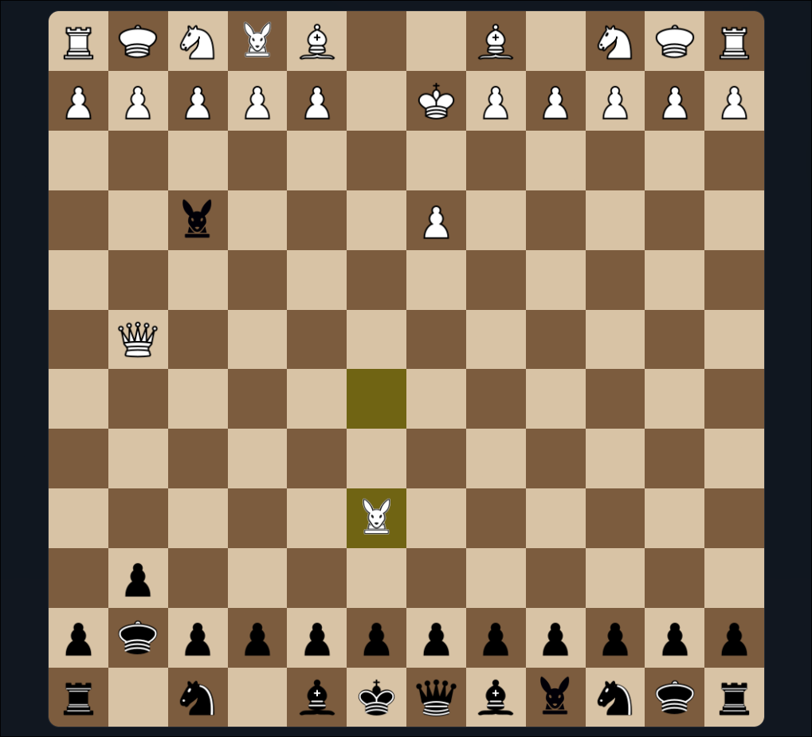

# Australian Chess

A multiplayer, real-time chess variant played on an expanded **12x12 board**, featuring custom pieces with unique movement rules. Built with a high-performance Go backend and a modern TypeScript frontend, coordinated via WebSockets for seamless gameplay.

**Play it live at [ausschess.com](https://ausschess.com)**

---

## Screenshot



---

## Features

- **12x12 Expanded Board** — New strategic depth beyond the traditional 8x8
- **Custom Pieces** — The **Kangaroo** and **Oligarch** add unique movement dynamics
- **Real-time Multiplayer** — WebSocket-powered instant move synchronization
- **Authentication** — Secure user registration and session management
- **Modern Tech Stack** — Go (Gin), TypeScript (Vite), PostgreSQL, Nginx, Docker

---

## Custom Pieces

### Kangaroo
Moves exactly **2 or 3 squares orthogonally** (up, down, left, or right). Cannot move diagonally.

### Oligarch
A context-aware piece with conditional movement:
- **Adjacent to a friendly piece** → moves like a **Queen** (all directions, unlimited range)
- **Isolated** (no adjacent friendly pieces) → moves like a **King** (one square in any direction)

### Starting Back Rank

```
Rook · Oligarch · Knight · Kangaroo · Bishop · Queen · King · Bishop · Kangaroo · Knight · Oligarch · Rook
```

---

## Tech Stack

| Layer      | Technology                          |
| :--------- | :---------------------------------- |
| Backend    | Go 1.26, Gin, Gorilla WebSocket     |
| Frontend   | TypeScript 5.9, Vite 8, Vanilla TS  |
| Database   | PostgreSQL 17, Goose (migrations)   |
| Infra      | Docker Compose, Nginx               |

---

## Project Structure

```
.
├── backend/
│   ├── cmd/api/              # Application entry point
│   ├── internal/
│   │   ├── auth/             # Authentication & session management
│   │   ├── chess/            # Core game engine & move validation
│   │   ├── config/           # Configuration management (Viper)
│   │   ├── contracts/        # Command/result contracts
│   │   ├── db/               # Database layer (pgx)
│   │   ├── http/gin/         # HTTP handlers
│   │   └── ws/               # WebSocket orchestration
│   ├── migrations/           # Database schema (Goose)
│   ├── rooms/                # Room management service
│   ├── sessions/             # Session management
│   └── users/                # User management
└── frontend/
    ├── src/
    │   ├── engine/           # Game rules ported to TypeScript
    │   ├── pages/            # Login, register, landing, game room
    │   ├── room/             # Room controller, socket, state, view
    │   ├── ui/               # UI helpers and components
    │   └── ws/               # WebSocket client utilities
    └── public/
        ├── pieces/           # Chess piece assets (white/black SVGs)
        └── sfx/              # Sound effects
```

---

## Setup & Installation

### 1. Configure Environment Variables

```bash
cp backend/.env.sample .env
cp backend/.env.sample backend/.env
```

Edit `.env` and set your preferred `DB_USERNAME`, `DB_PASSWORD`, and `DB_NAME`.

### 2. Build and Launch

```bash
docker-compose build --no-cache
docker-compose up -d
```

The backend automatically runs database migrations via Goose on startup.

### 3. Verify Services

```bash
docker ps
```

All three containers — `db`, `backend`, and `frontend` — should show as `Up`.

---

## Access Points

| Component    | URL                                                          | Port |
| :----------- | :----------------------------------------------------------- | :--- |
| Frontend UI  | [http://localhost](http://localhost)                         | `80` |
| Backend API  | [http://localhost:8080/api/v1](http://localhost:8080/api/v1) | `8080` |
| Database     | `localhost:5432`                                             | `5432` |

---

## Development

### Backend Tests

```bash
# Start test database
make -C backend test-db

# Run all tests
make -C backend test

# Run with coverage report
make -C backend coverage

# Generate HTML coverage report
make -C backend test-complete

# Tear down test database
make -C backend down-db
```

### Frontend (local dev)

```bash
cd frontend
npm install
npm run dev
```

---

## Architecture Overview

```
Browser  ──HTTP──►  Nginx (port 80)  ──proxy──►  Vite/TS Frontend
                                                         │
                                                    WebSocket
                                                         │
Browser  ──WS───►  Go Backend (port 8080)  ──────►  PostgreSQL
```

Move validation runs in **both** the TypeScript frontend (optimistic UI) and the Go backend (authoritative). The backend is the source of truth — all moves are re-validated server-side before being broadcast to players.
